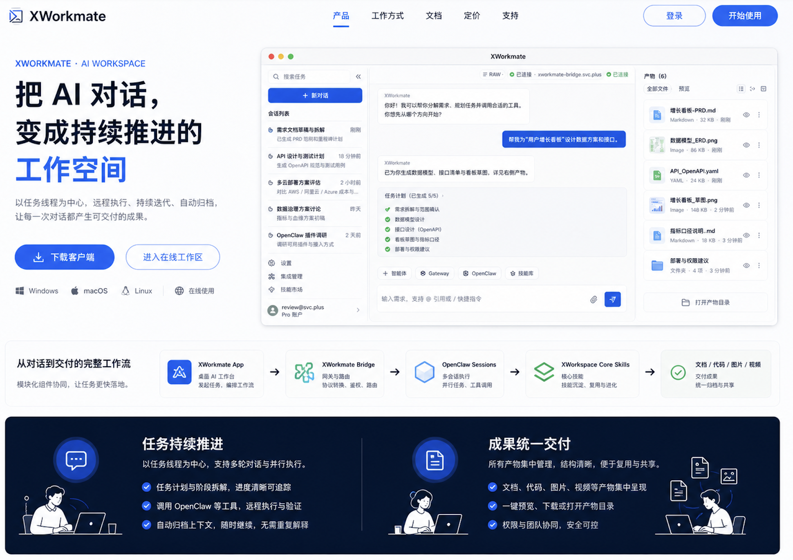

  

<h1 align="center">ai-workspace-lab</h1>

<strong>XWorkmate · AI Workspace for continuous task delivery</strong>

  
  
  
  

  <a href="#中文">中文</a> ｜ <a href="#english">English</a>

<table>
<tr>
<td valign="top" width="50%">

## 中文

`ai-workspace-lab` 是面向持续交付任务的 AI 工作区组织。我们把对话、任务、产物和执行过程整合进同一个工作空间，让协作不只停留在“问答”，而是可以持续推进、分阶段交付、并自动沉淀成果。

### 我们在做什么

- 构建以任务为中心的 AI 工作区与协作控制台
- 让对话驱动任务拆解、工具调用、执行验证和结果交付
- 将文档、代码、图片、视频等产物统一汇总到同一工作流
- 支持持续推进、上下文继承、自动归档与团队协作

### XWorkmate

我们的产品主页以 `XWorkmate` 为核心，强调“把 AI 对话变成持续推进的工作空间”：

- `对话`：围绕任务发起和持续追问
- `工作区`：统一承载执行、验证与交付
- `产物`：文档、代码、图片、视频集中呈现
- `协作`：支持团队共享、审阅与权限协同

### 核心能力

- 任务持续推进与上下文继承
- 多工具串联执行与结果验证
- 产物统一归档与可追溯交付
- 面向团队的协作与权限控制
- 与控制台、桥接层和核心技能联动

### 相关仓库

- [`xworkmate-app`](https://github.com/ai-workspace-lab/xworkmate-app)
- [`xworkmate-bridge`](https://github.com/ai-workspace-lab/xworkmate-bridge)
- [`xworkspace-console`](https://github.com/ai-workspace-lab/xworkspace-console)
- [`xworkspace-core-skills`](https://github.com/ai-workspace-lab/xworkspace-core-skills)
- [`X-Memory-Hub`](https://github.com/ai-workspace-lab/X-Memory-Hub)

### 访问入口

- 产品主页: [XWorkmate](https://console.svc.plus/products/xworkmate)
- 组织主页: [GitHub - ai-workspace-lab](https://github.com/ai-workspace-lab)

</td>
<td valign="top" width="50%">

## English

`ai-workspace-lab` is the organization behind an AI workspace designed for continuous task delivery. We bring conversations, tasks, artifacts, and execution into one shared workspace, so collaboration becomes more than Q&A: it can progress over time, deliver in stages, and preserve outcomes automatically.

### What we do

- Build a task-centered AI workspace and collaboration console
- Turn conversations into task decomposition, tool use, execution, and validation
- Bring documents, code, images, and videos into one delivery flow
- Support continuous progress, inherited context, auto-archiving, and team collaboration

### XWorkmate

Our product homepage centers on `XWorkmate`, with a simple idea: turn AI conversations into a continuously moving workspace.

- `Conversation` for starting and extending tasks
- `Workspace` for execution, verification, and delivery
- `Artifacts` for unified presentation of outputs
- `Collaboration` for review, sharing, and access coordination

### Core capabilities

- Continuous task progression with context inheritance
- Chained tool execution and result validation
- Unified artifact collection and traceable delivery
- Team-oriented collaboration and permission control
- Tight integration with the console, bridge, and core skills

### Related repositories

- [`xworkmate-app`](https://github.com/ai-workspace-lab/xworkmate-app)
- [`xworkmate-bridge`](https://github.com/ai-workspace-lab/xworkmate-bridge)
- [`xworkspace-console`](https://github.com/ai-workspace-lab/xworkspace-console)
- [`xworkspace-core-skills`](https://github.com/ai-workspace-lab/xworkspace-core-skills)
- [`X-Memory-Hub`](https://github.com/ai-workspace-lab/X-Memory-Hub)

### Entry points

- Product homepage: [XWorkmate](https://console.svc.plus/products/xworkmate)
- Organization page: [GitHub - ai-workspace-lab](https://github.com/ai-workspace-lab)

</td>
</tr>
</table>

---

  <strong>把 AI 对话，变成持续推进的工作空间</strong>

  <strong>Turn AI conversations into a workspace that keeps moving</strong>

