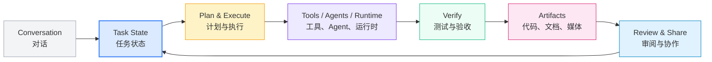

# ai-workspace-lab

AI 工作区产品与 Agent Runtime 实验室 | AI Workspace Product & Agent Runtime Lab

🇨🇳 简体中文 ｜ [🌐 English Version](#english)

---

## <a id="中文"></a>🇨🇳 组织概览

`ai-workspace-lab` 是 AI Workspace 的产品与运行时工程组织。我们把对话、任务、工具、执行过程和最终产物连接在同一个工作区里，让 AI 协作从一次性问答变成可持续推进、可验证交付的工作流。

### 我们的使命与交付准则

- **任务优先与上下文连续**：以任务作为协作基本单元，保留决策、状态、上下文和后续动作。
- **执行与验证闭环**：工具调用、运行时执行、测试和用户可见验收必须能够被追踪和复核。
- **组合式运行时**：通过标准化的 Bridge、Gateway、Plugin、Skill 和 MCP 接口连接不同 Agent 与服务。
- **产物可追溯**：文档、代码、图片、视频和构建产物统一归档，保留来源、版本和交付边界。
- **安全地持续推进**：凭据、权限和运行时状态由环境控制，产品层只消费明确授权的能力。

### 常用访问入口

- 产品主页：[XWorkmate](https://console.svc.plus/products/xworkmate)
- 组织主页：[GitHub - ai-workspace-lab](https://github.com/ai-workspace-lab)
- 工作区控制面：[XLaunch / XWorkspace Console](https://github.com/ai-workspace-lab/xworkspace-console)
- 快速安装 XWorkmate App：
  ```bash
  curl -sfL https://install.svc.plus/xworkmate-app | bash -
  ```
- 快速安装 AI Workspace Suite：
  ```bash
  curl -sfL https://raw.githubusercontent.com/ai-workspace-lab/XLaunch/main/scripts/setup-ai-workspace-all-in-one.sh | bash -
  ```

---

## 🏛️ 四大核心支柱 (Four Core Pillars)

### 🧭 Task-Centered Workspace

以任务为中心的工作区 _{把对话转化为可执行任务，持续承载计划、状态、上下文、审阅与交付。}_

### ⚡ Agent Execution & Bridge

组合式 Agent 执行层 _{通过 ACP Bridge、Gateway 和 OpenClaw Plugin 连接本地 Agent、远程 Provider 与多阶段任务运行时。}_

### 🧠 Memory, Skills & Artifacts

可复用的知识与产物层 _{用 Memory、Search、Skills 和 Artifact Contract 保存决策、检索上下文、生成内容并完成可验证交付。}_

### 🖥️ Runtime & Collaboration

面向真实环境的工作区运行时 _{覆盖桌面控制面、服务管理、远程访问、权限协作和跨平台工作流。}_

---

## 🔄 持续交付任务流水线 (Continuous Task Delivery)



1. **Conversation → Task**：从对话中形成任务、目标和验收标准。
2. **Task → Execution**：调用工具、Agent、Bridge 和外部服务推进任务。
3. **Execution → Verification**：运行测试、检查状态，并确认用户可见结果。
4. **Verification → Artifact**：沉淀代码、文档、媒体和结构化交付物。
5. **Artifact → Collaboration**：审阅、共享、继续推进或归档任务。

---

## 📦 核心仓库矩阵 (Core Repository Matrix)

| 仓库 (Repository) | 类型 / 定位 | 说明 / Function |
| --- | --- | --- |
| [`xworkmate-app`](https://github.com/ai-workspace-lab/xworkmate-app) | `Workspace Client` | Flutter 工作区客户端，连接本地与远程任务执行。 |
| [`xworkmate-bridge`](https://github.com/ai-workspace-lab/xworkmate-bridge) | `ACP Bridge` | Go 实现的 HTTP / WebSocket / stdio Bridge 与 Provider 转发层。 |
| [`xworkspace-console`](https://github.com/ai-workspace-lab/xworkspace-console) | `Control Plane` | XLaunch 与 XWorkspace Console，承载控制面、服务管理和桌面入口。 |
| [`openclaw-multi-session-plugins`](https://github.com/ai-workspace-lab/openclaw-multi-session-plugins) | `Agent Runtime` | OpenClaw 多会话隔离、任务作用域和 XWorkmate 产物处理插件。 |
| [`xworkspace-core-skills`](https://github.com/ai-workspace-lab/xworkspace-core-skills) | `Skills & Workflows` | 内容生产、工程规范、工作流编排和 Workspace Core Skills。 |
| [`X-Memory-Hub`](https://github.com/ai-workspace-lab/X-Memory-Hub) | `Memory Service` | PostgreSQL + pgvector 优先的 Memory REST / MCP 服务层。 |
| [`qmd`](https://github.com/ai-workspace-lab/qmd) | `Local Search` | 面向本地文档的 BM25、向量检索与 LLM 重排引擎。 |
| [`paxm`](https://github.com/ai-workspace-lab/paxm) | `Agent Memory CLI` | 在 Codex、Claude Code、OpenCode、Pi 等会话间传递决策与上下文。 |
| [`litellm`](https://github.com/ai-workspace-lab/litellm) | `AI Gateway` | 面向多模型 Provider 的 OpenAI-compatible Gateway。 |
| [`opencode`](https://github.com/ai-workspace-lab/opencode) | `Coding Agent` | 开源 AI Coding Agent 实验与集成。 |
| [`postgresql.svc.plus`](https://github.com/ai-workspace-lab/postgresql.svc.plus) | `Database & Vector` | PostgreSQL、pgvector、中文分词和安全连接底座。 |
| [`docs`](https://github.com/ai-workspace-lab/docs) | `Architecture & Delivery` | 架构、产品、交付和运行手册。 |

### 生态与实验仓库 (Ecosystem & Experiments)

- [`new-api`](https://github.com/ai-workspace-lab/new-api)：模型聚合、访问控制与 API 管理实验。
- [`CLIProxyAPI`](https://github.com/ai-workspace-lab/CLIProxyAPI)：CLI / Provider 代理集成实验。
- [`ai-desktop`](https://github.com/ai-workspace-lab/ai-desktop)：Debian / Ubuntu AI Desktop 运行时与会话组件。

---

## <a id="english"></a>🌐 English

`ai-workspace-lab` is the product and runtime engineering organization for AI Workspace. We connect conversations, tasks, tools, execution, and artifacts in one workspace so AI collaboration can keep moving, be verified, and produce traceable outcomes.

### Mission and delivery principles

- **Task-centered and context-continuous**: treat tasks as the unit of collaboration, preserving decisions, state, context, and next actions.
- **Execution with verification**: make tool calls, runtime execution, tests, and user-visible acceptance traceable and reviewable.
- **Composable runtime**: connect agents and services through Bridge, Gateway, Plugin, Skill, and MCP interfaces.
- **Traceable artifacts**: keep code, documents, media, and build outputs discoverable with their source, version, and delivery boundary.
- **Secure continuous progress**: keep credentials, permissions, and runtime state environment-owned and explicitly authorized.

### Product entry points

- Product: [XWorkmate](https://console.svc.plus/products/xworkmate)
- Organization: [GitHub - ai-workspace-lab](https://github.com/ai-workspace-lab)
- Control plane: [XLaunch / XWorkspace Console](https://github.com/ai-workspace-lab/xworkspace-console)

### Four core pillars

- **Task-Centered Workspace** — turn conversations into executable tasks with plans, state, context, review, and delivery.
- **Agent Execution & Bridge** — connect local agents, remote providers, and multi-stage runtimes through ACP, Gateway, and OpenClaw.
- **Memory, Skills & Artifacts** — preserve decisions, retrieve context, compose reusable skills, and deliver verifiable artifacts.
- **Runtime & Collaboration** — provide the desktop control plane, service operations, remote access, permissions, and shared workflows.

### Repository map

The repository matrix above is the current map of the product, runtime, memory, gateway, database, and documentation layers. Start with `xworkmate-app` for the client, `xworkmate-bridge` for execution transport, `xworkspace-console` for the control plane, and `xworkspace-core-skills` for reusable workflows.

---

<p align="center">
  <strong>把 AI 对话，变成持续推进的工作空间</strong><br />
  <em>Turn AI conversations into a workspace that keeps moving.</em>
</p>
